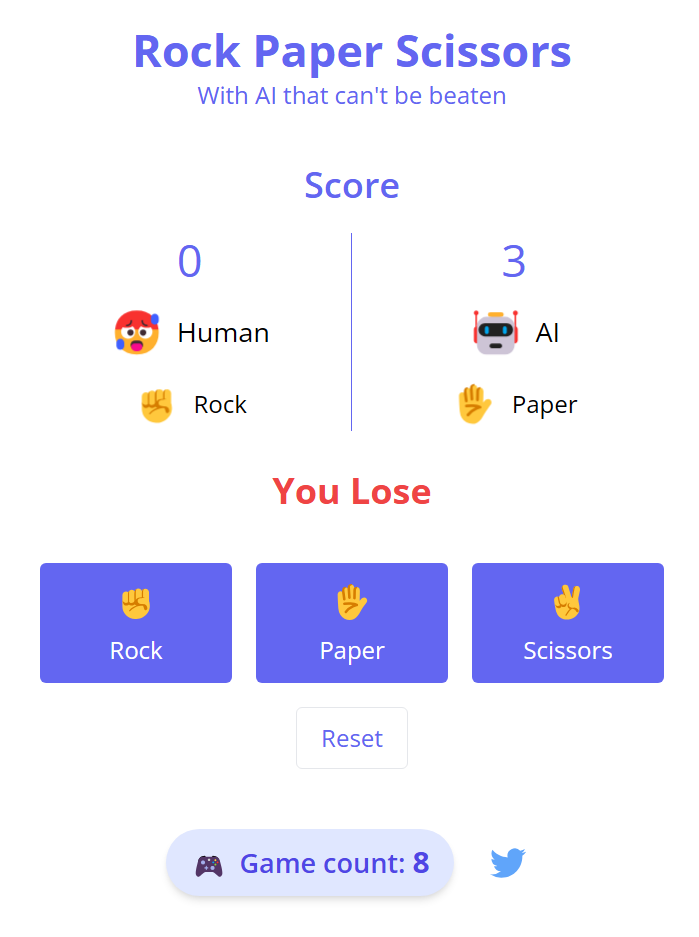

# Rock Paper Scissors Game with AI

> Demo

http://rockpaperscissors-game.org

## What is this?

Welcome to AI Rock Paper Scissors - a classic game with a twist!

Our smart AI learns from your moves, adapting its strategy to challenge you in exciting ways. Can you outsmart it?

Using Nuxt.js & Tailwind CSS for a smooth, responsive experience.

## Screensot



## How to play?

1. Start by choosing Rock ✊, Paper ✋, or Scissors ✌️.
2. Keep playing and see if you can spot patterns in the AI's choices.
3. Try different strategies! Here are some ideas:

   * Go for the same choice multiple times
   * Alternate between two choices
   * Use a three-move sequence
   * Mix it up randomly
   * 
4. Watch how the AI adapts to your style. Can you stay one step ahead?

## Build setup

```bash
# install dependencies
$ yarn install

# serve with hot reload at localhost:3000
$ yarn dev

# build for production and launch server
$ yarn build
$ yarn start

# generate static project
$ yarn generate
```

For detailed explanation on how things work, check out [Nuxt.js docs](https://nuxtjs.org).
